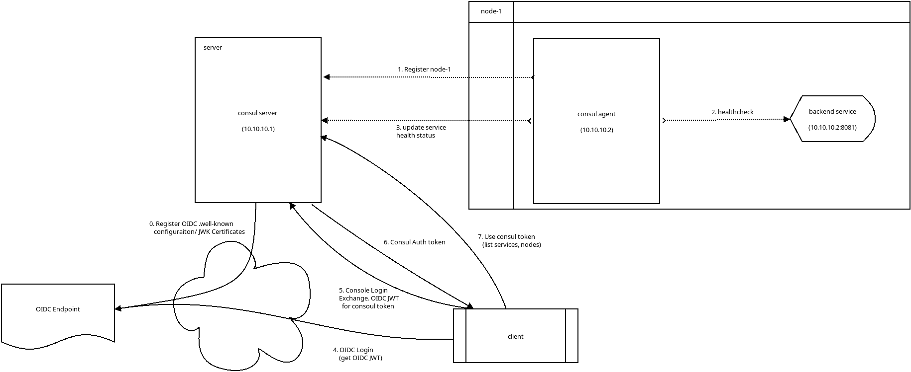
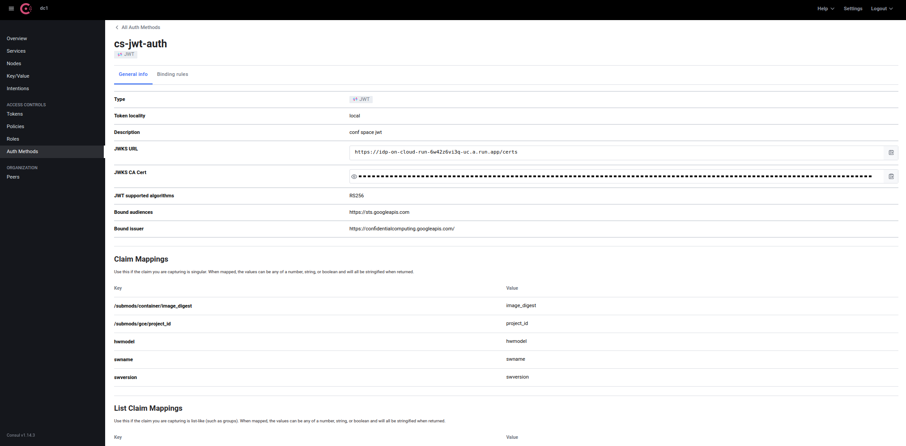
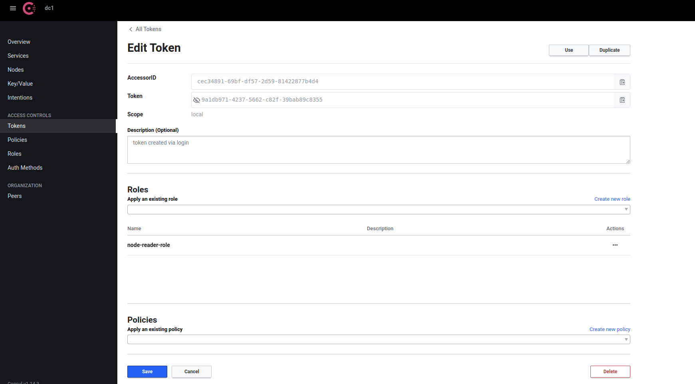

## Hashicorp Consul JWT Auth

A simple standalone demo of [Consul JWT Authentication](https://developer.hashicorp.com/consul/docs/security/acl/auth-methods/jwt) comprising of

* server node
* agent node
* backend service
* oidc server
* client
  * logs in to oidc server
  * exchanges oidc JWT token for consul token
  * uses consul token to query service status

Basically, nothing new but the important thing is the JWT OIDC configuration which can be used with any provider.

The specific JWT format shown is taken from [Google Confidential Space](https://github.com/salrashid123/confidential_space)



---

This repo contains the actual configuration (encryption keys, certificates, ACLs) I used so you can just use it as a quickstart.

If you want to do this from start to finish, remove the `data/` and `data_agent/` folders and start from scratch. 


---

### QuickStart

First you need to download the [Console CLI](https://developer.hashicorp.com/consul/downloads).

I used

```bash
$ ./consul --version
Consul v1.14.3
Revision bd257019
Build Date 2022-12-13T17:13:55Z
Protocol 2 spoken by default, understands 2 to 3 (agent will automatically use protocol >2 when speaking to compatible agents)
```


```bash

sudo ifconfig lo:0 10.10.10.1 up
sudo ifconfig lo:1 10.10.10.2 up

# start server
./consul agent  -config-file config/server.hcl  -bind 10.10.10.1 -bootstrap-expect 1 

# in new window start backend servie
cd server/
go run main.go

# in new window start agent on node-1
./consul agent   -config-dir=client_config/ -node=node-1 -join "server.dc1.consul" -bind 10.10.10.2   \
     -dns-port 18600 -http-port 18500 -https-port 18501 -grpc-tls-port 18503 -disable-keyring-file

# in new window get JWT token
export URL=https://idp-on-cloud-run-6w42z6vi3q-uc.a.run.app
export IAT=`date -u +%s`
export EXP=`date -u +%s -d "+3600 seconds"`
export EMAIL="operator-svc-account@vegas-codelab-5.iam.gserviceaccount.com"
export SUB="https://www.googleapis.com/compute/v1/projects/vegas-codelab-5/zones/us-central1-a/instances/vm1"
export ISS="https://confidentialcomputing.googleapis.com/"
export NAME="alice"
export AUD="https://sts.googleapis.com"
envsubst < "acl/jwt.tmpl" > "acl/jwt.json"

export JWT_TOKEN=`curl -s -X POST -d @acl/jwt.json  $URL/token`
echo $JWT_TOKEN

echo -n $JWT_TOKEN > /tmp/jwt_token.txt

# login to consul
./consul login -method=cs-jwt-auth -type=jwt -token-sink-file=/tmp/consul.token -bearer-token-file /tmp/jwt_token.txt -ca-file=consul-agent-ca.pem

# use token inline
./consul catalog nodes -service=app -detailed -ca-file consul-agent-ca.pem -token=`cat /tmp/consul.token`

./consul watch -type=service -service=app -ca-file consul-agent-ca.pem -token=`cat /tmp/consul.token`
```

---

### End-To-End

In each step, i've shown the output i recieved in the following line.

First remove the existing data files and certificates

```bash
rm -rf data/ data_agent/ consul-agent* dc1-*
```

In each step, i've echoed the values i got with teh default repo config.  Your values will be different

#### Create root encryption key

```bash
$ ./consul keygen
  E7deVao78CvZrzayUvwWdlAy4nqBMxzIudNyMEz9VlA=

export CONSUL_KEY=E7deVao78CvZrzayUvwWdlAy4nqBMxzIudNyMEz9VlA=
```

#### Configure interface aliases

Configure some virtual interfaces so that Consul's protocol thinks the agnet and server are on different hosts.

```bash
sudo ifconfig lo:0 10.10.10.1 up
sudo ifconfig lo:1 10.10.10.2 up
```

#### Configure Server

edit `config/server.hcl` and set your value of `$CONSUL_KEY`

```hcl
data_dir = "data/"
log_level = "INFO"
node_name = "server"
server = true,
encrypt = "$CONSUL_KEY",
encrypt_verify_incoming = true,
encrypt_verify_outgoing = true,
acl = {
  enabled = true
  default_policy = "deny"
  enable_token_persistence = true
},
auto_encrypt {
  allow_tls = true
},
ui = true,
tls {
  defaults {
    ca_file = "consul-agent-ca.pem",
    cert_file = "dc1-server-consul-0.pem",
    key_file = "dc1-server-consul-0-key.pem",
    verify_incoming = true,
    verify_outgoing = true    
  },
}
```

#### Create TLS keys

Remember to have removed the previous files

```
$ ./consul tls ca create
$ ./consul tls cert create -server -dc dc1
```

#### Run Consul server 

bind it to `10.10.10.1`

```
$ ./consul agent  -config-file config/server.hcl  -bind 10.10.10.1 -bootstrap-expect 1 
```


#### Bootstrap consul

Get the root `CONSUL_HTTP_TOKEN` which is the `SecretID`

```
$ ./consul acl bootstrap

    AccessorID:       da55ef86-5ec3-c8ca-9221-aa6a06846957
    SecretID:         bc97f983-161a-80c4-b98f-a663736a21ed
    Description:      Bootstrap Token (Global Management)
    Local:            false
    Create Time:      2023-02-02 02:48:44.025957485 -0500 EST
    Policies:
      00000000-0000-0000-0000-000000000001 - global-management
```

export the token

```bash
export CONSUL_HTTP_TOKEN=bc97f983-161a-80c4-b98f-a663736a21ed

test configuration
$ ./consul info
```

You can use this token to Access local/dev UI at  [http://localhost:8500/ui/dc1/overview/server-status](http://localhost:8500/ui/dc1/overview/server-status)

#### Create Node-1 token

```
$ ./consul acl token create -description "node-1 agent token"  -node-identity "node-1:dc1"

    AccessorID:       14bde2d3-2321-3717-cac3-1e6048ef3a89
    SecretID:         018bb862-2dca-9a42-0ae4-d967158a8e4f
    Description:      node-1 agent token
    Local:            false
    Create Time:      2023-02-02 02:49:25.606181559 -0500 EST
    Node Identities:
      node-1 (Datacenter: dc1)
```

export the token

```bash
export NODE_1_TOKEN=018bb862-2dca-9a42-0ae4-d967158a8e4f
```


#### Create node policy

```bash
$ ./consul acl policy create -name node-1-policy -rules @acl/node-1-policy.hcl

    ID:           be324658-6b6f-5e8c-44bb-ee5fb54bf9ae
    Name:         node-1-policy
    Description:  
    Datacenters:  
    Rules:
    node "node-1"{
      policy = "write"
    }


    key "_rexec" {
      policy = "write"
    }
```

#### Create app policy

```bash
$ ./consul acl policy create -name app-policy -rules @acl/app-policy.hcl

    ID:           c4d0fc69-f298-10ff-069d-11d1ffbe28ec
    Name:         app-policy
    Description:  
    Datacenters:  
    Rules:
    service "app" {
      policy = "write"
      policy = "read"
    }
```

#### Create token for app

```
$ ./consul acl token create -description "Token for app" -service-identity "app"

    AccessorID:       47a56a74-9e2f-5170-c7d4-1c6b6d436f47
    SecretID:         ec388620-fa58-2c90-2a6c-10ff31d40cc3
    Description:      Token for app
    Local:            false
    Create Time:      2023-02-02 02:52:17.304826715 -0500 EST
    Service Identities:
      app (Datacenters: all)

```

export the token

```bash
export APP_TOKEN=ec388620-fa58-2c90-2a6c-10ff31d40cc3
```

#### Create node reader policy

```
$ ./consul acl policy create -name node-reader -rules @acl/node-reader.hcl

    ID:           74a2903e-0bef-025d-5966-3e7c5e590451
    Name:         node-reader
    Description:  
    Datacenters:  
    Rules:
    service "app" {
      policy = "read"
    }

    node_prefix "" {
      policy = "read"
    }

```

#### Roles

Create roles

```
$ ./consul acl role create -name "node-reader-role" -description "node-reader role" -policy-name "node-reader"

  ID:           6e58df7b-7af2-bc00-a26b-b51f23ab2314
  Name:         node-reader-role
  Description:  node-reader role
  Policies:
    74a2903e-0bef-025d-5966-3e7c5e590451 - node-reader

```

```
$ ./consul acl role create -name "node-role" -description "node role" -policy-name "node-1-policy"

    ID:           c76f5de9-c0fe-1dba-544e-a3574914990a
    Name:         node-role
    Description:  node role
    Policies:
      be324658-6b6f-5e8c-44bb-ee5fb54bf9ae - node-1-policy

```

#### Configure Workload federation

We can now configure Consul to validate an OIDC endpoint.

For this we will use a fake OIDC server from [https://github.com/salrashid123/workload_federation_cloudrun_gcf#1--fake-oidc-server](https://github.com/salrashid123/workload_federation_cloudrun_gcf#1--fake-oidc-server) I setup here.


```
$ ./consul acl auth-method create -name=cs-jwt-auth -type jwt  -description 'conf space jwt' -config=@acl/cs-jwt-auth.json

  Name:          cs-jwt-auth
  Type:          jwt
  Description:   conf space jwt
  Config:
  {
    "BoundAudiences": [
      "https://sts.googleapis.com"
    ],
    "BoundIssuer": "https://confidentialcomputing.googleapis.com/",
    "ClaimMappings": {
      "/submods/container/image_digest": "image_digest",
      "/submods/gce/project_id": "project_id",
      "hwmodel": "hwmodel",
      "swname": "swname",
      "swversion": "swversion"
    },
    "JWKSURL": "https://idp-on-cloud-run-6w42z6vi3q-uc.a.run.app/certs",
    "JWTSupportedAlgs": [
      "RS256"
    ],
    "ListClaimMappings": {
      "google_service_accounts": "google_service_accounts"
    }
  }

```



#### Create binding rule

Now set more fine grained ACL to use claims within the OIDC JWT for role-binding.

```bash
$ ./consul acl binding-rule create -method=cs-jwt-auth -bind-type=role -bind-name=node-reader-role \
       -selector="value.swname==CONFIDENTIAL_SPACE and value.image_digest==\"sha256:c693f5cf4f447b31e8c0ae7f784fc754f783f2e64f8836913c22264004204f6b\" and value.swversion==1"

    ID:           099a7a8f-599a-bac5-b2de-e360830bf51e
    AuthMethod:   cs-jwt-auth
    Description:  
    BindType:     role
    BindName:     node-reader-role
    Selector:     value.swname==CONFIDENTIAL_SPACE and value.image_digest=="sha256:c693f5cf4f447b31e8c0ae7f784fc754f783f2e64f8836913c22264004204f6b" and value.swversion==1

```


### Run backend server on "node-1"

```bash
cd server/
go run main.go
```

### Run consul agent on "node-1"

using values set earlier for encryption and node tokens

```bash
export CONSUL_KEY=E7deVao78CvZrzayUvwWdlAy4nqBMxzIudNyMEz9VlA=
export NODE_1_TOKEN=018bb862-2dca-9a42-0ae4-d967158a8e4f
```

edit `config/agent.hcl` and set the values in the file

```
data_dir = "/tmp/data"
log_level = "INFO"
node_name = "node-1"
server = false,
encrypt = "$CONSUL_KEY",

ui = false,
auto_encrypt {
  tls = true
},
tls {
  defaults {
    ca_file = "consul-agent-ca.pem",
    verify_incoming = true,
    verify_outgoing = true    
  },
}
acl {
  tokens {
    agent  = "$NODE_1_TOKEN"
  }
}

```

Again using value for app token from earlier

```bash
export APP_TOKEN=ec388620-fa58-2c90-2a6c-10ff31d40cc3
```

edit `config/client_config.json`

```
{
  "service": {
    "name": "app",
    "id": "app-1",
    "port": 8081,
    "token": "$APP_TOKEN",
    "check": {
      "http": "http://localhost:8081/healthz",
      "method": "GET",
      "interval": "1s",
      "timeout": "1s"
    }
  }
}

```

#### Start node-1 agent

```
$ ./consul agent   -config-dir=client_config/ -node=node-1 -join "server.dc1.consul" -bind 10.10.10.2   \
     -dns-port 18600 -http-port 18500 -https-port 18501 -grpc-tls-port 18503 -disable-keyring-file
```

---

#### Get OIDC Token

In a **NEW** window, acquire JWT access token and use that to register to consul


```bash
export URL=https://idp-on-cloud-run-6w42z6vi3q-uc.a.run.app
export IAT=`date -u +%s`
export EXP=`date -u +%s -d "+3600 seconds"`

export EMAIL="operator-svc-account@vegas-codelab-5.iam.gserviceaccount.com"
export SUB="https://www.googleapis.com/compute/v1/projects/vegas-codelab-5/zones/us-central1-a/instances/vm1"
export ISS="https://confidentialcomputing.googleapis.com/"
export NAME="alice"
export AUD="https://sts.googleapis.com"
envsubst < "acl/jwt.tmpl" > "acl/jwt.json"

export JWT_TOKEN=`curl -s -X POST -d @acl/jwt.json  $URL/token`
echo $JWT_TOKEN

echo -n $JWT_TOKEN > /tmp/jwt_token.txt
```

THe OIDC token returned is in the form:

```json
{
  "alg": "RS256",
  "kid": "123456",
  "typ": "JWT"
}.
{
  "aud": "https://sts.googleapis.com",
  "dbgstat": "disabled-since-boot",
  "exp": 1675332164,
  "google_service_accounts": [
    "operator-svc-account@vegas-codelab-5.iam.gserviceaccount.com"
  ],
  "hwmodel": "GCP_AMD_SEV",
  "iat": 1675328564,
  "iss": "https://confidentialcomputing.googleapis.com/",
  "nbf": 1675328564,
  "oemid": 11129,
  "secboot": true,
  "sub": "https://www.googleapis.com/compute/v1/projects/vegas-codelab-5/zones/us-central1-a/instances/vm1",
  "submods": {
    "container": {
      "args": [
        "/server"
      ],
      "cmd_override": null,
      "env": {
        "HOSTNAME": "vm1",
        "PATH": "/usr/local/sbin:/usr/local/bin:/usr/sbin:/usr/bin:/sbin:/bin",
        "SSL_CERT_FILE": "/etc/ssl/certs/ca-certificates.crt"
      },
      "env_override": null,
      "image_digest": "sha256:c693f5cf4f447b31e8c0ae7f784fc754f783f2e64f8836913c22264004204f6b",
      "image_id": "sha256:3eee5e759e56f75f4a6fe0538a74aa1cb2dd17e5e1887c0ede63c426ad72ad37",
      "image_reference": "us-central1-docker.pkg.dev/mineral-minutia-820/repo1/myimage@sha256:c693f5cf4f447b31e8c0ae7f784fc754f783f2e64f8836913c22264004204f6b",
      "restart_policy": "Never"
    },
    "gce": {
      "instance_id": "3507932791508176595",
      "instance_name": "vm1",
      "project_id": "vegas-codelab-5",
      "project_number": "75457521745",
      "zone": "us-central1-a"
    }
  },
  "swname": "CONFIDENTIAL_SPACE",
  "swversion": "1",
  "tee": {
    "container": {
      "args": [
        "/server"
      ],
      "cmd_override": null,
      "env": {
        "HOSTNAME": "vm1",
        "PATH": "/usr/local/sbin:/usr/local/bin:/usr/sbin:/usr/bin:/sbin:/bin",
        "SSL_CERT_FILE": "/etc/ssl/certs/ca-certificates.crt"
      },
      "env_override": null,
      "image_digest": "sha256:c693f5cf4f447b31e8c0ae7f784fc754f783f2e64f8836913c22264004204f6b",
      "image_id": "sha256:3eee5e759e56f75f4a6fe0538a74aa1cb2dd17e5e1887c0ede63c426ad72ad37",
      "image_reference": "us-central1-docker.pkg.dev/mineral-minutia-820/repo1/myimage@sha256:c693f5cf4f447b31e8c0ae7f784fc754f783f2e64f8836913c22264004204f6b",
      "restart_policy": "Never"
    },
    "emails": [
      "operator-svc-account@vegas-codelab-5.iam.gserviceaccount.com"
    ],
    "gce": {
      "instance_id": "3507932791508176595",
      "instance_name": "vm1",
      "project_id": "vegas-codelab-5",
      "project_number": "75457521745",
      "zone": "us-central1-a"
    },
    "platform": {
      "hardware_technology": "AMD_SEV"
    },
    "version": {
      "major": 0,
      "minor": 1
    }
  }
}
```

#### Login to consul

Using the OIDC token specified in the `bearer-token-file` parameter.

Write the consul token to `/tmp/consul.token`

```bash
$ ./consul login -method=cs-jwt-auth -type=jwt -token-sink-file=/tmp/consul.token -bearer-token-file /tmp/jwt_token.txt -ca-file=consul-agent-ca.pem


# ofcourse your token will be different
cat /tmp/consul.token 
   9a1db971-4237-5662-c82f-39bab89c8355
```



Use token to access consul server

```bash
./consul catalog nodes -service=app -detailed -ca-file consul-agent-ca.pem -token=`cat /tmp/consul.token`

Node    ID                                    Address     DC   TaggedAddresses                                                           Meta
node-1  9882a9b4-87b4-2957-439c-43cbf8814854  10.10.10.2  dc1  lan=10.10.10.2, lan_ipv4=10.10.10.2, wan=10.10.10.2, wan_ipv4=10.10.10.2  consul-network-segment=
```


```json
./consul watch -type=service -service=app -ca-file consul-agent-ca.pem -token=`cat /tmp/consul.token`
```